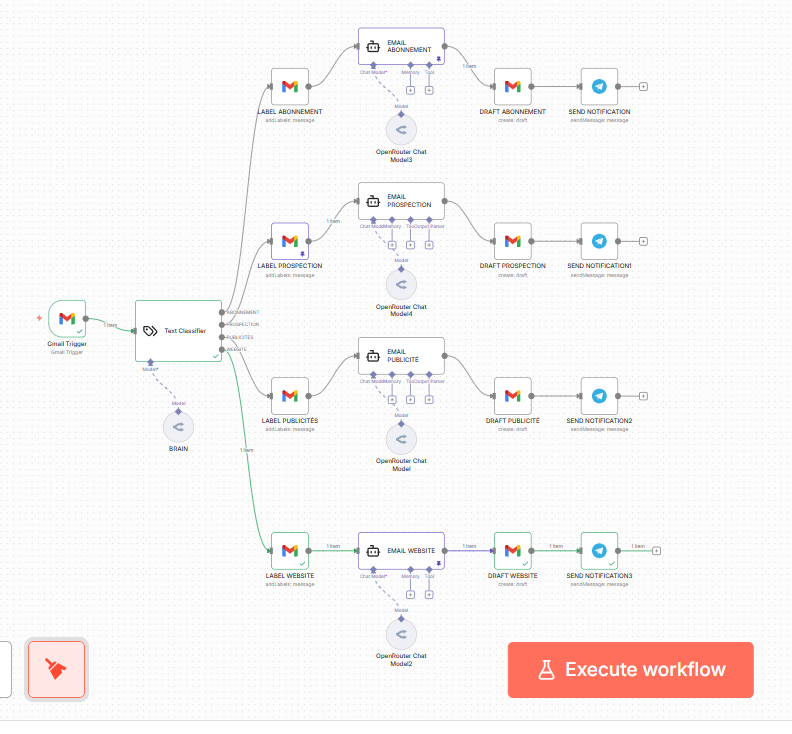

# 🤖 Smart Email Agent: IA & Automation pour E-commerce

> **Agent IA d'automatisation Gmail via n8n pour e-commerce. Workflow intelligent de classification d'emails et rédaction de brouillons personnalisés avec Llama 3.3 et Mistral.**

---

## 📺 Aperçu du Workflow

*Visualisation de l'architecture logique : du trigger Gmail à la notification Telegram.*

## 🎯 Valeur Ajoutée Business
Ce workflow ne se contente pas de trier des emails ; il remplace une première ligne de support client :
- **Réduction du temps de réponse** : Brouillons générés instantanément pour validation humaine.
- **Organisation chirurgicale** : Classification sémantique (Abonnement, Prospection, Publicité, Website) et étiquetage automatique.
- **Disponibilité 24/7** : Monitoring constant de la boîte mail sans intervention manuelle.
- **Alerte Haute Priorité** : Notification directe sur Telegram pour les messages critiques.

## 🛠️ Stack Technique & Intelligence
- **Orchestration** : [n8n](https://n8n.io/)
- **Modèles LLM (via OpenRouter)** : `Llama 3.3 70B` & `Mistral 7B`
- **Connecteurs** : Gmail API, Telegram Bot API, LangChain.

## 🚀 Installation
1. Téléchargez le fichier `workflow.json` présent dans ce dépôt.
2. Importez-le dans votre instance n8n.
3. Configurez vos credentials (Gmail, Telegram, OpenRouter).
4. Activez le workflow.

---
## 👤 À propos d'AutomagiqueIA
Expert en **AI Automation**, je conçois des agents intelligents pour scaler le support client e-commerce.

📫 **Contactez-moi sur LinkedIn :** www.linkedin.com/in/désiré-nkurunziza-9375ba356
